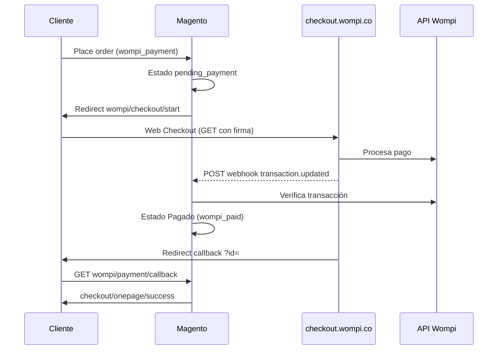

# Flujo de pago

<p align="left">
  
</p>

## Diagrama



## Paso a paso

### 1. Checkout Magento

El cliente elige **Wompi** y confirma el pedido. El método `wompi_payment` inicializa el pedido en `pending_payment`.

### 2. Redirect a Wompi

Knockout ejecuta `afterPlaceOrder` ? `wompi/checkout/start`.

El controlador construye el payload (`CheckoutFlowResolver`) y envía un formulario GET a `https://checkout.wompi.co/p/`.

Campos principales:

| Campo | Origen |
|-------|--------|
| `public-key` | Config (entorno activo) |
| `reference` | `increment_id` del pedido |
| `amount-in-cents` | Total en COP (centavos) |
| `signature:integrity` | HMAC con integrity secret |
| `redirect-url` | `wompi/payment/callback` del store |

### 3. Webhook (fuente de verdad)

Wompi envía `POST` a `wompi/payment/webhook`. Ver [webhook.md](webhook.md).

### 4. Callback del navegador

```
GET /{store}/wompi/payment/callback?id={transaction_id}
```

Consulta API Wompi y actualiza el pedido si aún no está pagado (idempotente).

## Rutas

| Ruta | Controlador | Método |
|------|-------------|--------|
| `wompi/checkout/start` | `Checkout\Start` | GET |
| `wompi/payment/callback` | `Payment\Callback` | GET |
| `wompi/payment/webhook` | `Payment\Webhook` | POST |
| `wompi/payment/redirect` | `Payment\Redirect` | GET (alias) |

Front name: `wompi` (`etc/frontend/routes.xml`).

## Siguiente paso

[order-states.md](order-states.md) — significado de estados tras el pago.
